# Skill Dependency Graph

> Generated from `docs/skill-manifest.json` by `.forge/skill_graph.py`. Do not edit by hand; run the script. `validate_library.py` checks edge existence, ownership fields, cycles, reachability, and contract shape.

## Orchestration edges

```mermaid
graph LR
  resonance-engineering-build --> resonance-engineering-backend
  resonance-engineering-build --> resonance-engineering-frontend
  resonance-engineering-build --> resonance-engineering-debugger
  resonance-engineering-build --> resonance-ops-security
  resonance-engineering-build --> resonance-ops-audit
  resonance-finance-run-operating-cycle --> resonance-strategy-finance
  resonance-finance-run-operating-cycle --> resonance-marketing-analytics
  resonance-finance-run-operating-cycle --> resonance-ops-legal
  resonance-leadership-run-operating-cycle --> resonance-ops-founder-os
  resonance-leadership-run-operating-cycle --> resonance-people-hiring
  resonance-leadership-run-operating-cycle --> resonance-ops-productivity
  resonance-leadership-run-operating-cycle --> resonance-ops-retro
  resonance-leadership-run-operating-cycle --> resonance-ops-legal
  resonance-marketing-run-campaign --> resonance-strategy-gtm-thinker
  resonance-marketing-run-campaign --> resonance-strategy-growth
  resonance-marketing-run-campaign --> resonance-strategy-grill
  resonance-marketing-run-campaign --> resonance-marketing-copywriter
  resonance-marketing-run-campaign --> resonance-marketing-content-distribution
  resonance-marketing-run-campaign --> resonance-marketing-lifecycle
  resonance-marketing-run-campaign --> resonance-marketing-paid-acquisition
  resonance-marketing-run-campaign --> resonance-marketing-analytics
  resonance-marketing-run-campaign --> resonance-design-studio
  resonance-marketing-run-campaign --> resonance-ops-legal
  resonance-ops-audit --> resonance-ops-security
  resonance-ops-audit --> resonance-ops-reviewer
  resonance-ops-audit --> resonance-ops-qa
  resonance-ops-audit --> resonance-strategy-architect
  resonance-ops-core --> resonance-strategy-plan
  resonance-ops-core --> resonance-engineering-backend
  resonance-ops-core --> resonance-engineering-frontend
  resonance-ops-core --> resonance-design-designer
  resonance-ops-goal --> resonance-strategy-grill
  resonance-ops-goal --> resonance-strategy-plan
  resonance-ops-goal --> resonance-engineering-build
  resonance-ops-goal --> resonance-ops-qa
  resonance-ops-goal --> resonance-ops-audit
  resonance-ops-goal --> resonance-ops-second-opinion
  resonance-ops-goal --> resonance-ops-ship
  resonance-ops-improve --> resonance-ops-skill-author
  resonance-ops-improve --> resonance-ops-second-opinion
  resonance-ops-page-audit --> resonance-ops-system-health
  resonance-ops-page-audit --> resonance-ops-audit
  resonance-ops-page-audit --> resonance-marketing-conversion
  resonance-ops-page-audit --> resonance-marketing-copywriter
  resonance-ops-page-audit --> resonance-design-designer
  resonance-ops-page-audit --> resonance-marketing-seo
  resonance-ops-page-audit --> resonance-ops-qa
  resonance-ops-system-health --> resonance-ops-qa
  resonance-ops-system-health --> resonance-ops-security
  resonance-sales-run-revenue-motion --> resonance-sales-account-intelligence
  resonance-sales-run-revenue-motion --> resonance-sales-lead-ops
  resonance-sales-run-revenue-motion --> resonance-sales-outbound-sequence
  resonance-sales-run-revenue-motion --> resonance-sales-call-intelligence
  resonance-sales-run-revenue-motion --> resonance-sales-pipeline
  resonance-sales-run-revenue-motion --> resonance-sales-revops
  resonance-sales-run-revenue-motion --> resonance-success-customer-success
  resonance-sales-run-revenue-motion --> resonance-ops-legal
  resonance-software-deliver-change --> resonance-ops-goal
  resonance-strategy-brief --> resonance-strategy-grill
  resonance-strategy-brief --> resonance-strategy-plan
  resonance-strategy-brief --> resonance-engineering-build
  resonance-strategy-brief --> resonance-ops-product
  resonance-strategy-brief --> resonance-strategy-researcher
  resonance-strategy-council --> resonance-strategy-brief
  resonance-strategy-council --> resonance-strategy-grill
  resonance-strategy-council --> resonance-strategy-plan
  resonance-strategy-council --> resonance-ops-goal
  resonance-strategy-council --> resonance-ops-second-opinion
  resonance-strategy-plan --> resonance-ops-product
  resonance-strategy-plan --> resonance-strategy-researcher
  resonance-strategy-plan --> resonance-strategy-venture
```

## Edges

| Orchestrator | Invokes |
| --- | --- |
| resonance-engineering-build | resonance-engineering-backend, resonance-engineering-frontend, resonance-engineering-debugger, resonance-ops-security, resonance-ops-audit |
| resonance-finance-run-operating-cycle | resonance-strategy-finance, resonance-marketing-analytics, resonance-ops-legal |
| resonance-leadership-run-operating-cycle | resonance-ops-founder-os, resonance-people-hiring, resonance-ops-productivity, resonance-ops-retro, resonance-ops-legal |
| resonance-marketing-run-campaign | resonance-strategy-gtm-thinker, resonance-strategy-growth, resonance-strategy-grill, resonance-marketing-copywriter, resonance-marketing-content-distribution, resonance-marketing-lifecycle, resonance-marketing-paid-acquisition, resonance-marketing-analytics, resonance-design-studio, resonance-ops-legal |
| resonance-ops-audit | resonance-ops-security, resonance-ops-reviewer, resonance-ops-qa, resonance-strategy-architect |
| resonance-ops-core | resonance-strategy-plan, resonance-engineering-backend, resonance-engineering-frontend, resonance-design-designer |
| resonance-ops-goal | resonance-strategy-grill, resonance-strategy-plan, resonance-engineering-build, resonance-ops-qa, resonance-ops-audit, resonance-ops-second-opinion, resonance-ops-ship |
| resonance-ops-improve | resonance-ops-skill-author, resonance-ops-second-opinion |
| resonance-ops-page-audit | resonance-ops-system-health, resonance-ops-audit, resonance-marketing-conversion, resonance-marketing-copywriter, resonance-design-designer, resonance-marketing-seo, resonance-ops-qa |
| resonance-ops-system-health | resonance-ops-qa, resonance-ops-security |
| resonance-sales-run-revenue-motion | resonance-sales-account-intelligence, resonance-sales-lead-ops, resonance-sales-outbound-sequence, resonance-sales-call-intelligence, resonance-sales-pipeline, resonance-sales-revops, resonance-success-customer-success, resonance-ops-legal |
| resonance-software-deliver-change | resonance-ops-goal |
| resonance-strategy-brief | resonance-strategy-grill, resonance-strategy-plan, resonance-engineering-build, resonance-ops-product, resonance-strategy-researcher |
| resonance-strategy-council | resonance-strategy-brief, resonance-strategy-grill, resonance-strategy-plan, resonance-ops-goal, resonance-ops-second-opinion |
| resonance-strategy-plan | resonance-ops-product, resonance-strategy-researcher, resonance-strategy-venture |

## Ownership Contracts

| Skill | Archetype | Authority | Failure | Side effects |
| --- | --- | --- | --- | --- |
| resonance-design-designer | knowledge | advisory | degrade | none |
| resonance-design-studio | procedure | consequential | stop | may_write_files |
| resonance-engineering-ai-engineering | knowledge | advisory | degrade | none |
| resonance-engineering-automation | procedure | consequential | stop | may_write_files |
| resonance-engineering-backend | knowledge | advisory | degrade | none |
| resonance-engineering-build | orchestration | consequential | stop | may_coordinate_work, may_write_files |
| resonance-engineering-database | knowledge | advisory | degrade | none |
| resonance-engineering-debugger | procedure | consequential | stop | may_write_files |
| resonance-engineering-devops | knowledge | advisory | degrade | none |
| resonance-engineering-frontend | knowledge | advisory | degrade | none |
| resonance-engineering-game-dev | knowledge | advisory | degrade | none |
| resonance-engineering-mobile | knowledge | advisory | degrade | none |
| resonance-engineering-performance | procedure | consequential | stop | may_write_files |
| resonance-finance-run-operating-cycle | orchestration | consequential | stop | may_coordinate_work, may_write_files |
| resonance-leadership-run-operating-cycle | orchestration | consequential | stop | may_coordinate_work, may_write_files |
| resonance-marketing-analytics | knowledge | advisory | degrade | none |
| resonance-marketing-content-distribution | knowledge | advisory | degrade | none |
| resonance-marketing-conversion | procedure | consequential | stop | may_write_files |
| resonance-marketing-copywriter | knowledge | advisory | degrade | none |
| resonance-marketing-lifecycle | knowledge | advisory | degrade | none |
| resonance-marketing-paid-acquisition | knowledge | advisory | degrade | none |
| resonance-marketing-run-campaign | orchestration | consequential | stop | may_coordinate_work, may_write_files |
| resonance-marketing-seo | knowledge | advisory | degrade | none |
| resonance-ops-audit | orchestration | consequential | stop | may_coordinate_work, may_execute_checks |
| resonance-ops-core | orchestration | consequential | stop | may_coordinate_work, may_write_files |
| resonance-ops-explain | procedure | consequential | stop | may_write_files |
| resonance-ops-founder-os | knowledge | advisory | degrade | none |
| resonance-ops-goal | orchestration | consequential | stop | may_coordinate_work, may_write_files |
| resonance-ops-handover | procedure | consequential | stop | may_write_files |
| resonance-ops-improve | orchestration | consequential | stop | may_coordinate_work, may_write_files |
| resonance-ops-incident | procedure | consequential | stop | may_write_files |
| resonance-ops-legal | knowledge | advisory | degrade | none |
| resonance-ops-librarian | procedure | consequential | stop | may_write_files |
| resonance-ops-observability | knowledge | advisory | degrade | none |
| resonance-ops-page-audit | orchestration | consequential | stop | may_coordinate_work, may_execute_checks |
| resonance-ops-product | knowledge | advisory | degrade | none |
| resonance-ops-productivity | knowledge | advisory | degrade | none |
| resonance-ops-qa | procedure | consequential | stop | may_write_files |
| resonance-ops-refactor | procedure | consequential | stop | may_write_files |
| resonance-ops-retro | procedure | consequential | stop | may_write_files |
| resonance-ops-reviewer | procedure | consequential | stop | may_write_files |
| resonance-ops-second-opinion | procedure | consequential | stop | may_write_files |
| resonance-ops-security | procedure | consequential | stop | may_write_files |
| resonance-ops-ship | procedure | consequential | stop | may_write_files |
| resonance-ops-skill-author | procedure | consequential | stop | may_write_files |
| resonance-ops-system-health | orchestration | consequential | stop | may_coordinate_work, may_execute_checks |
| resonance-ops-update-resonance | procedure | consequential | stop | may_write_files |
| resonance-ops-update-roadmap | procedure | consequential | stop | may_write_files |
| resonance-ops-voice | procedure | consequential | stop | may_write_files |
| resonance-people-hiring | knowledge | advisory | degrade | none |
| resonance-research-market-research | procedure | consequential | stop | may_write_files |
| resonance-sales-account-intelligence | procedure | consequential | stop | may_write_files |
| resonance-sales-call-intelligence | procedure | consequential | stop | may_write_files |
| resonance-sales-cold-call | procedure | consequential | stop | may_write_files |
| resonance-sales-lead-ops | procedure | consequential | stop | may_write_files |
| resonance-sales-outbound-sequence | procedure | consequential | stop | may_write_files |
| resonance-sales-pipeline | procedure | consequential | stop | may_write_files |
| resonance-sales-revops | knowledge | advisory | degrade | none |
| resonance-sales-run-revenue-motion | orchestration | consequential | stop | may_coordinate_work, may_write_files |
| resonance-software-deliver-change | orchestration | consequential | stop | may_coordinate_work |
| resonance-strategy-architect | knowledge | advisory | degrade | none |
| resonance-strategy-brief | orchestration | consequential | stop | may_coordinate_work, may_execute_authorized_work |
| resonance-strategy-council | orchestration | consequential | stop | may_coordinate_work, may_write_files |
| resonance-strategy-finance | knowledge | advisory | degrade | none |
| resonance-strategy-grill | procedure | consequential | stop | may_write_files |
| resonance-strategy-growth | knowledge | advisory | degrade | none |
| resonance-strategy-gtm-thinker | procedure | consequential | stop | may_write_files |
| resonance-strategy-plan | orchestration | consequential | stop | may_coordinate_work |
| resonance-strategy-researcher | procedure | consequential | stop | may_write_files |
| resonance-strategy-venture | procedure | consequential | stop | may_write_files |
| resonance-success-customer-success | knowledge | advisory | degrade | none |

## Validation

This graph is valid.
