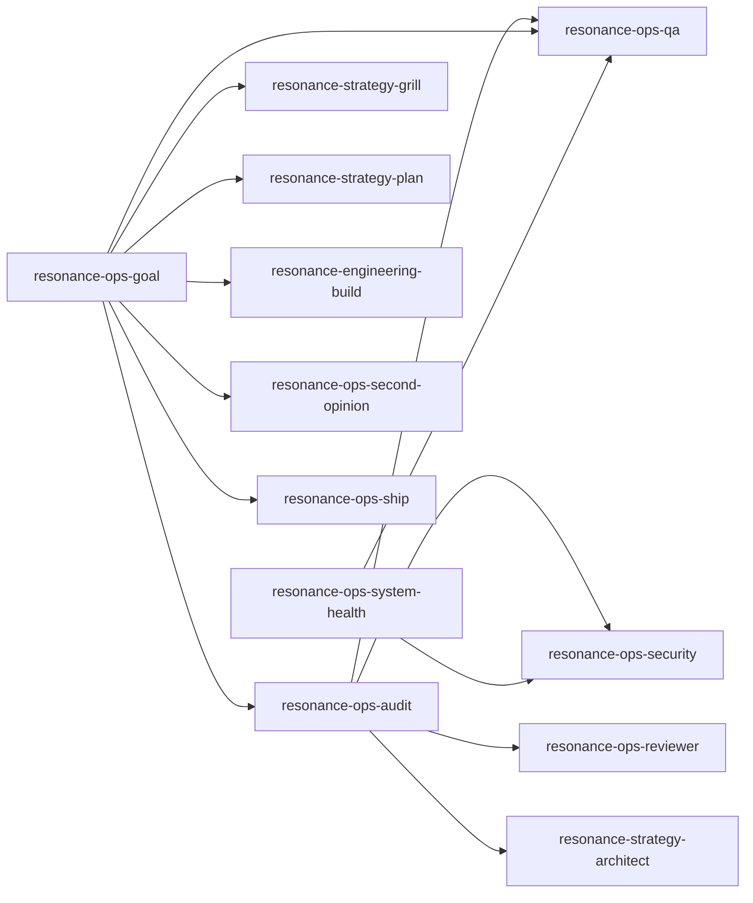

# Skill Dependency Graph

> Generated from the `invokes:` frontmatter of each skill by `.forge/skill_graph.py`. Do not edit by hand; run the script. `validate_library.py` checks that every edge below resolves to a real skill, so a renamed or missing delegate fails the build.

## Orchestration edges

## Edges

| Orchestrator | Invokes |
| --- | --- |
| resonance-ops-audit | resonance-ops-security, resonance-ops-reviewer, resonance-ops-qa, resonance-strategy-architect |
| resonance-ops-goal | resonance-strategy-grill, resonance-strategy-plan, resonance-engineering-build, resonance-ops-qa, resonance-ops-audit, resonance-ops-second-opinion, resonance-ops-ship |
| resonance-ops-system-health | resonance-ops-qa, resonance-ops-security |
